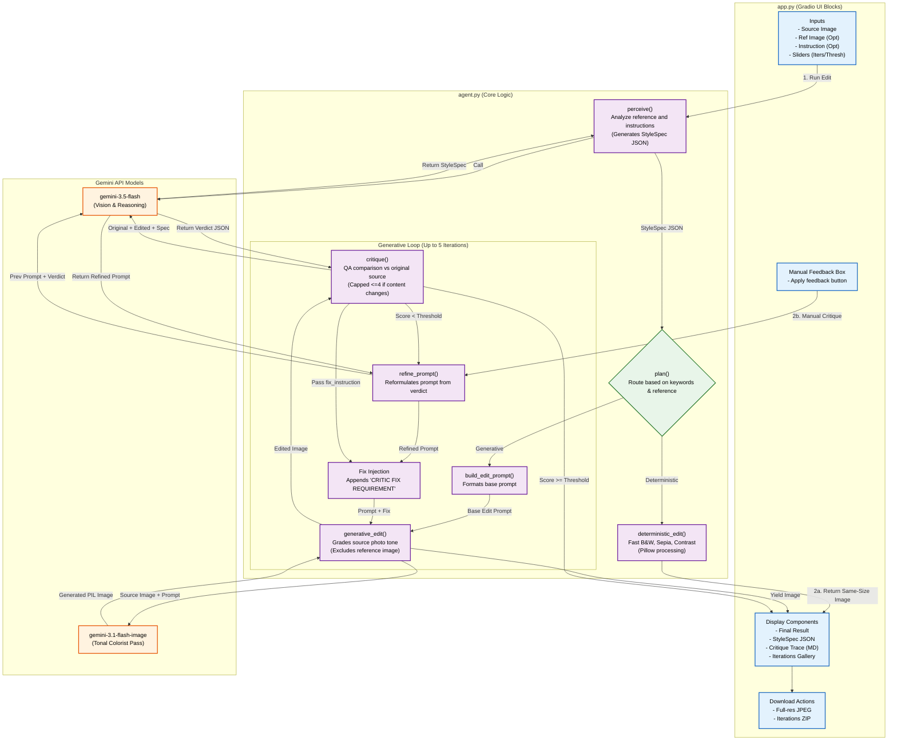

# Architecture Diagram - Style-Match Photo Editor

This document outlines the architecture, data flow, and components of the Style-Match Photo Editor application.

## Component Flow Diagram

The flowchart below displays how user inputs are processed, how the agent routes tasks, how the generative loop critiques and refines prompts (with fix instructions), and how outputs are exported.



## Architecture Details

### 1. Separation of Concerns (`agent.py` vs `app.py`)
- **`agent.py`** is UI-free and entirely testable headlessly. It handles the parsing, client construction, routing, edits, critique scoring invariants, and cli invocation flags.
- **`app.py`** imports `agent.py` and implements the Gradio Blocks page wrapper. It manages session variables cleanly in memory using `gr.State`.

### 2. Guardrails Against Content Changes
- **Reference Image Isolation**: The reference image is used solely to construct the text `StyleSpec` in the `perceive` phase. It is **never** sent to `gemini-3.1-flash-image` during editing, preventing compositional leaks (like background clouds, scenery elements, or smoothing effects).
- **Critic Verification**: The critic compares the graded result against the **original source photo** (rather than the reference) to catch any structural modifications. If it spots a change, the loop score is capped at $\leq 4$.

### 3. Iterative Critique Fix Injections
1. **Base Edit**: The prompt is built from the `StyleSpec` using `EDIT_TEMPLATE`.
2. **Analysis**: The critic outputs a `Verdict` detailing the score, content changes, biggest gap, and a concrete `fix_instruction`.
3. **Refinement**: If the score is below the threshold, `refine_prompt` uses `gemini-3.5-flash` to rewrite the prompt.
4. **Appendment**: To guarantee the instruction is prioritized, the prompt for the next iteration is formatted as:
   ```text
   [Refined Prompt]
   
   CRITIC FIX REQUIREMENT: [Verdicts fix_instruction]
   ```
5. **Human Input Integration**: Feedback typed by the user is passed in as a dummy critique verdict, causing the next loop iteration to inject it under `CRITIC FIX REQUIREMENT`.
